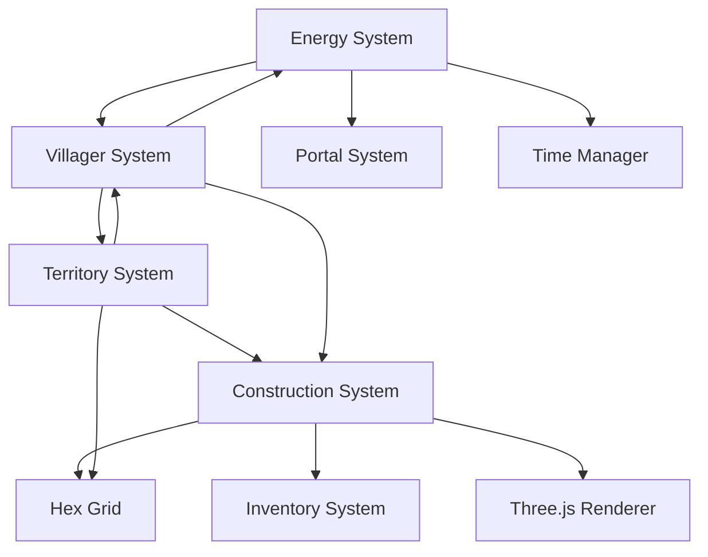

# Architecture: Spatial Systems

## System Overview

This document describes the technical architecture for integrating the modular construction, portal energy, and territory systems with the existing village builder codebase.

## Architecture Principles

1. **Modularity**: Each system can function independently
2. **Extensibility**: Easy to add new building components or rules
3. **Performance**: Optimized for large villages (50+ buildings, 20+ villagers)
4. **Compatibility**: Integrates cleanly with existing systems

## System Dependencies



## Core Architecture

### 1. Construction System

```typescript
// Core interfaces
interface BuildingComponent {
  id: string;
  position: HexCoord;
  type: ComponentType;
  material: MaterialType;
  mesh: THREE.Mesh;
  weight: number;
  supportProvided: number;
  supportRequired: number;
}

interface Building {
  id: string;
  components: Map<string, BuildingComponent>;
  bounds: BoundingBox;
  occupants: string[]; // villager IDs
  structuralIntegrity: number;
}

// Manager classes
class BuildingManager {
  private buildings: Map<string, Building>;
  private componentGrid: SpatialHash<BuildingComponent>;
  
  addComponent(component: BuildingComponent): boolean;
  removeComponent(componentId: string): boolean;
  checkStructuralIntegrity(buildingId: string): boolean;
  getComponentsAt(coord: HexCoord): BuildingComponent[];
}

class BuildingRenderer {
  private instancedMeshes: Map<string, THREE.InstancedMesh>;
  private LODManager: LODSystem;
  
  renderBuildings(buildings: Building[], camera: THREE.Camera): void;
  updateLOD(camera: THREE.Camera): void;
}
```

### 2. Energy System

```typescript
interface EnergyState {
  current: number;
  maximum: number;
  drainRate: number;
  lastRechargePos: THREE.Vector3;
  workRadius: number;
}

class EnergyManager {
  private villagerEnergy: Map<string, EnergyState>;
  private portalFields: Map<string, PortalEnergyField>;
  
  updateEnergy(deltaTime: number): void;
  startRecharge(villagerId: string, portalId: string): void;
  canWork(villagerId: string, position: THREE.Vector3): boolean;
  getWorkRadius(villagerId: string): number;
}

class PortalEnergyField {
  id: string;
  position: HexCoord;
  radius: number;
  rechargeRate: number;
  queue: string[]; // villager IDs
  
  isInRange(position: THREE.Vector3): boolean;
  addToQueue(villagerId: string): void;
  processQueue(deltaTime: number): void;
}
```

### 3. Territory System

```typescript
interface Territory {
  id: string;
  name: string;
  hexes: Set<string>; // hex coordinate strings
  type: TerritoryType;
  assignedVillagers: Set<string>;
  efficiency: number;
  metadata: TerritoryMetadata;
}

class TerritoryManager {
  private territories: Map<string, Territory>;
  private hexOwnership: Map<string, string>; // hex -> territory ID
  
  createTerritory(hexes: HexCoord[], type: TerritoryType): Territory;
  assignVillager(territoryId: string, villagerId: string): void;
  calculateEfficiency(territory: Territory): number;
  getTerritoriesInRange(center: HexCoord, radius: number): Territory[];
}

class TerritoryRenderer {
  private overlayMaterial: THREE.ShaderMaterial;
  private territoryMeshes: Map<string, THREE.Mesh>;
  
  renderTerritoryOverlay(territories: Territory[]): void;
  highlightTerritory(territoryId: string): void;
}
```

## Integration Points

### With Existing Systems

#### HexGrid Integration
```typescript
// Extend existing HexGrid
class HexGrid {
  // Existing methods...
  
  // New methods for construction
  getHexElevation(coord: HexCoord): number;
  isHexBuildable(coord: HexCoord): boolean;
  getHexSupport(coord: HexCoord): number;
}
```

#### Villager Integration
```typescript
// Extend VillagerState
interface VillagerState {
  // Existing fields...
  
  // New fields
  energy: EnergyState;
  assignedTerritories: string[];
  housing: {
    buildingId: string;
    roomId: string;
    quality: number;
  } | null;
}

// Extend Villager class
class Villager {
  // Existing methods...
  
  // New methods
  updateEnergy(deltaTime: number): void;
  seekRecharge(): void;
  evaluateHousing(building: Building): number;
  workInTerritory(territory: Territory): void;
}
```

#### Portal Integration
```typescript
// Extend Portal class
class Portal {
  // Existing fields...
  
  // New fields
  energyField: PortalEnergyField;
  
  // New methods
  upgradeEnergyField(level: number): void;
  getRechargeQueue(): Villager[];
}
```

## Data Flow

### Construction Flow
1. Player selects component and material
2. BuildingPlacer shows preview with validation
3. On placement:
   - BuildingManager validates support
   - Component added to spatial grid
   - Renderer updates instanced mesh
   - StructuralIntegrity recalculates

### Energy Flow
1. Every frame:
   - EnergyManager updates all villager energy
   - Check if any villager needs recharge
2. On low energy:
   - Villager pathfinds to nearest portal
   - Joins recharge queue
   - Energy refills over time
3. Work radius updates based on energy

### Territory Flow
1. Player draws territory boundary
2. TerritoryManager validates hexes
3. On creation:
   - Hexes marked as owned
   - Efficiency calculated
   - Renderer creates overlay
4. Villager assigned to territory
5. Task system prioritizes territory tasks

## Performance Optimizations

### Rendering
```typescript
class BuildingBatchRenderer {
  private materialBatches: Map<MaterialType, InstancedMeshBatch>;
  
  constructor() {
    // Pre-create instanced meshes for each material
    this.initializeBatches();
  }
  
  addComponent(component: BuildingComponent): void {
    const batch = this.materialBatches.get(component.material);
    batch.addInstance(component.getMatrix());
  }
}
```

### Spatial Indexing
```typescript
class SpatialHash<T> {
  private grid: Map<string, Set<T>>;
  private cellSize: number;
  
  insert(item: T, position: Vector3): void;
  query(bounds: BoundingBox): T[];
  remove(item: T, position: Vector3): void;
}
```

### Update Loops
```typescript
class SystemScheduler {
  // Update different systems at different rates
  private schedules = {
    construction: 1000, // 1 Hz
    energy: 200,        // 5 Hz  
    territory: 500,     // 2 Hz
    rendering: 16       // 60 Hz
  };
  
  update(deltaTime: number): void {
    // Only update systems when needed
    this.updateScheduled(deltaTime);
  }
}
```

## Memory Management

### Component Pooling
```typescript
class ComponentPool<T> {
  private available: T[] = [];
  private active: Set<T> = new Set();
  
  acquire(): T {
    return this.available.pop() || this.create();
  }
  
  release(item: T): void {
    this.active.delete(item);
    this.available.push(item);
    this.reset(item);
  }
}
```

### LOD System
```typescript
class BuildingLOD {
  private LODMeshes: Map<string, THREE.LODMesh>;
  
  createLOD(building: Building): THREE.LOD {
    const lod = new THREE.LOD();
    
    // High detail - all components
    lod.addLevel(this.createHighDetail(building), 0);
    
    // Medium detail - simplified geometry
    lod.addLevel(this.createMediumDetail(building), 50);
    
    // Low detail - single box
    lod.addLevel(this.createLowDetail(building), 100);
    
    return lod;
  }
}
```

## Save/Load Architecture

```typescript
interface SaveData {
  version: number;
  buildings: SerializedBuilding[];
  territories: SerializedTerritory[];
  energyStates: SerializedEnergyState[];
}

class SaveManager {
  save(): SaveData {
    return {
      version: 1,
      buildings: this.serializeBuildings(),
      territories: this.serializeTerritories(),
      energyStates: this.serializeEnergy()
    };
  }
  
  load(data: SaveData): void {
    // Version checking
    if (data.version !== 1) {
      this.migrate(data);
    }
    
    // Restore state
    this.restoreBuildings(data.buildings);
    this.restoreTerritories(data.territories);
    this.restoreEnergy(data.energyStates);
  }
}
```

## Event System

```typescript
enum SpatialEvent {
  BuildingPlaced = 'building:placed',
  BuildingRemoved = 'building:removed',
  BuildingCollapsed = 'building:collapsed',
  
  TerritoryCreated = 'territory:created',
  TerritoryModified = 'territory:modified',
  TerritoryAssigned = 'territory:assigned',
  
  EnergyLow = 'energy:low',
  EnergyRecharged = 'energy:recharged',
  PortalUpgraded = 'portal:upgraded'
}

class SpatialEventBus extends EventEmitter {
  emitBuildingPlaced(building: Building): void {
    this.emit(SpatialEvent.BuildingPlaced, building);
  }
  
  // UI and systems can subscribe to events
  onBuildingPlaced(callback: (building: Building) => void): void {
    this.on(SpatialEvent.BuildingPlaced, callback);
  }
}
```

## Error Handling

```typescript
class SpatialSystemError extends Error {
  constructor(
    public system: 'construction' | 'energy' | 'territory',
    public code: string,
    message: string
  ) {
    super(message);
  }
}

// Usage
throw new SpatialSystemError(
  'construction',
  'INSUFFICIENT_SUPPORT',
  'Cannot place component without adequate support'
);
```

## Testing Strategy

### Unit Tests
- Component weight/support calculations
- Territory efficiency algorithms
- Energy drain/recharge math
- Structural integrity checks

### Integration Tests
- Building collapse scenarios
- Territory assignment conflicts
- Energy system edge cases
- Cross-system interactions

### Performance Tests
- 100+ building stress test
- 20+ villager pathfinding
- Territory overlay rendering
- Memory leak detection

## Future Considerations

### Planned Extensions
1. District-level management
1. Inter-building connections